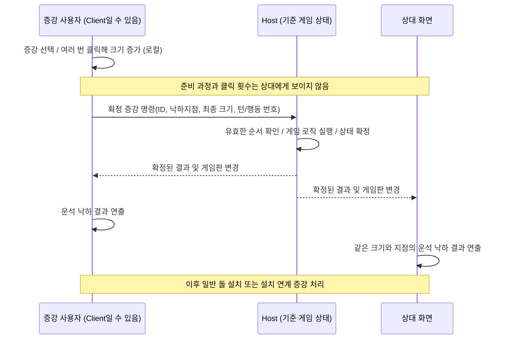

# 증강 육목 — 멀티플레이 개발 논의 정리

> **목적:** 현재 진행 중인 Unity 게임 프로젝트의 멀티플레이 구현 방향을 CLI 기반 코딩 도구에 넘기기 위한 인수인계 문서.
>
> **작성 기준:** 2026-10-08까지 이 대화 및 추가 답변을 반영함. 실제 프로젝트 코드나 구성은 확인하지 않았으며, 코드 예시는 설계 참고용이다. **사용자가 확정한 요구사항**과 **구현 추천안**을 구분한다.

## 1. 프로젝트 개요

- **게임명(가칭):** 증강 육목
- **장르/구조:** 두 플레이어가 번갈아 돌을 두는 육목에, 특정 턴마다 얻은 **증강(Augment)**을 사용하는 턴제 게임.
- **개발 환경:** **Unity 6000.6.0f1**. 현재 네트워크 패키지 설치 여부는 프로젝트 검사 필요.
- **목표:** 멀티플레이 구현 후 **대회에 출품 및 시연**.
- **배포 계획:** 현재 없음.
- **개발 상황:** 돌 놓기, 증강의 획득과 사용을 위한 기본 시스템은 구현됨. 개별 증강 효과 구현은 추가 작업이 필요함. 멀티플레이는 구현 목표이며, 현재 구현 여부는 확인되지 않음.
- **인력 및 인프라:** 팀에 서버 개발에 능숙한 사람이 없고, 별도의 자체 서버도 없음. 설명/발표를 담당할 인원이 있으나 Unity를 다루지 못함. 따라서 네트워크 작업량과 유지보수 부담을 최소화해야 함.
- **보안 수준:** 대회 시연이 주목적이므로, 클라이언트 조작·치트 방지보다 **작동의 단순성, 안정적인 동기화, 구현 용이성**을 우선해도 됨.

## 2. 사용자가 직접 제시한 구상 및 제약

### 2.1 기본 플레이

1. 서로 번갈아 좌표를 선택하여 돌을 둔다.
2. 특정 턴마다 증강을 **시드 기반으로 랜덤 획득**한다.
3. 일반적으로 **증강 사용 → 돌 설치** 순서로 한 턴을 진행한다.
4. **예외:** 일부 증강은 **돌을 놓는 행위로 증강이 발동**하므로, 증강 적용과 돌 설치를 함께 처리해야 한다.
5. 증강은 **사용 사실/진행 중/확정 결과**가 구분된다. 이 상태를 그대로 다른 플레이어에게 모두 보여줄 필요는 없다.

### 2.2 네트워크 통신에 대한 최초 구상

- **돌 설치:** 놓은 돌의 좌표만 전송한다.
- **증강 획득:** 최초 구상은 난수 **시드(seed)**를 공유하여 같은 증강 획득 결과를 유지하는 것.
- **증강 사용:** 사용자의 준비/조작 모션은 본인 화면에서만 표시하고, 상대방 화면에서는 결과 중심의 애니메이션만 표시한다.
- **목표:** 서버 사용량과 서버 측 구현을 최대한 줄인다.

### 2.3 사용자 답변으로 확정된 조건

- **원격 접속 선호:** 가능하면 **서로 다른 인터넷망**에서도 두 PC가 접속할 수 있어야 한다.
- **접속 UI:** 가장 구현하기 쉬운 방식을 선호한다. 방 만들기 → **참여 코드 전달/입력**을 추천(추천안, 사용자 확정 기술 아님).
- **시연 장비:** **PC 2대**. 기본적으로 학교 네트워크에 함께 연결할 예정이며 다른 네트워크에서도 접속 가능하면 좋다.
- **증강 획득:** **공통 시드에 기반한 동일한 랜덤 획득**을 유지한다. 증강 획득의 무작위성은 제거하지 않는다.
- **증강 효과:** **효과 실행에 랜덤 요소를 두지 않을 계획**이다. 좌표를 직접 변경하는 방식으로 구현할 예정(아직 모든 효과 코드 검증 전).
- **증강 선행 조작:** 운석 낙하 전 여러 번 클릭하여 운석 크기를 키우는 등의 조작은 **사용자 본인 화면에서만** 보인다.
- **공유되는 결과:** 확정된 운석의 **크기·낙하지점** 같은 최종 파라미터와 그 결과 연출만 상대에게 보인다. 결과가 확정된 이후에는 양쪽 게임판 상태가 동일해야 한다.
- **연결 종료/재접속:** 초기 구현에서 복잡한 예외 처리는 후순위로 두고, 개발 상황에 따라 추가한다.
- **게임판 상태 동기화:** 사용자는 아직 방식을 정하지 못함. 아래에서 구현이 쉬운 권장안을 제시한다.

### 2.4 증강의 3단계와 턴 규칙

| 구분 | 발생하는 일 | 상대에게 보내는 정보(추천) |
| --- | --- | --- |
| **사용 사실/시작** | 증강을 선택하거나 사용을 개시 | 로컬 준비 단계라면 **전송하지 않음**. 단, 턴 잠금/상태 표시가 게임 규칙상 필요하면 최소 상태만 전송 |
| **사용 중(준비·조작)** | 클릭 반복으로 운석 크기 증가, 방향 지정 등 | **전송하지 않음**. 로컬에서 입력·연출 처리 |
| **사용 결과 확정(Commit)** | 증강 ID, 목표 위치, 최종 크기 등 확정 | **확정된 입력 파라미터를 호스트에 전송**. 호스트가 결과를 결정하고 양쪽 결과 연출·게임판 갱신 |

- 일반 턴: `증강 선택/준비 → 증강 결과 확정·반영 → 돌 놓기 → 턴 종료` (증강을 사용하지 않는 턴의 세부 흐름은 기존 코드 확인).
- **돌 설치 발동형 증강:** `증강 준비 → 돌 설치 좌표 선택 → 설치 + 증강 발동을 하나의 확정 동작으로 처리 → 턴 종료`.
- 동일 돌 설치가 **일반 돌 설치 메시지**와 **증강 발동 메시지** 양쪽에서 중복 적용되지 않도록 주의한다.
- 증강 결과를 확정하기 전에는 턴을 넘기지 않고, 결과 연출이 턴 종료를 지연해야 하는지는 각 증강 특성 및 기존 코드를 보고 결정한다.

## 3. 현재까지의 권장 아키텍처

### 3.1 큰 방향

**한 플레이어가 호스트(Host), 다른 플레이어가 클라이언트(Client)가 되는 호스트-클라이언트 방식**을 우선 검토한다.

- 호스트 PC가 연결 및 기준 게임 상태를 관리한다.
- 별도 전용 서버 컴퓨터/서버 호스팅은 필요하지 않다.
- 단, 호스트 역할은 기술적으로 서버 기능을 포함한다. '서버가 완전히 없는 구조'와는 다르다.
- 두 플레이어가 네트워크로 직접 연결할 수 있다면 P2P에 가까운 운영이 가능하다.
- 호스트 종료 시 연결도 종료되는 단순 구조로 시작한다. 복잡한 호스트 이전은 우선순위가 낮다.

### 3.2 Unity 네트워킹 선택지 (추천 업데이트)

**우선 추천: NGO(Netcode for GameObjects) + Unity Multiplayer Services SDK의 Relay 기반 Session.**

- 구성: **한 PC가 호스트, 다른 PC가 클라이언트**. 전용 자체 게임 서버 불필요.
- 연결 UX: 호스트가 방 생성 → **참여 코드** 표시 → 다른 PC에서 참여 코드 입력. 서로 다른 인터넷망에서 사용할 수 있는 방식을 우선 고려한다.
- Relay는 **Unity가 운영하는 중계 서비스**다. 순수한 단말 간 직접 통신(P2P)과 달리 외부 서비스/인터넷 연결이 필요하지만, 직접 서버를 구축하거나 포트포워딩할 필요가 없다는 장점이 있다.
- 최신 Unity 공식 가이드에서 **Multiplayer Services SDK는 Sessions 방식으로 Relay/Lobby 기능을 묶어서 제공**한다. 새 프로젝트에서는 이 경로를 우선 검토한다.
- **NGO + LAN**은 필요하다면 오프라인/사전 테스트용 보조 경로로 고려하지만, 학교 무선망이 기기 간 직접 통신을 차단할 수도 있으므로 유일한 시연 방식으로 의존하지 않는다.
- 실제 **패키지 조합 및 API**는 Unity 6000.6.0f1 프로젝트의 `Packages/manifest.json`과 공식 문서를 보고 결정한다. 이미 다른 네트워킹 패키지가 있다면 우선 평가한다.

| 방식 | 원격 서로 다른 인터넷망 | 자체 서버 | 개발 우선순위 |
| --- | --- | --- | --- |
| **NGO + Multiplayer Services Sessions + Relay** | **지원**(연결되는 인터넷 환경에서) | 불필요, Unity Relay 이용 | **1순위 추천** |
| **NGO + 직접 LAN 접속** | 보통 별도 네트워크 설정 필요 | 불필요 | 보조/테스트 |
| **직접 TCP/UDP/P2P 연결 코드 작성** | NAT/방화벽 문제를 직접 해결해야 함 | 별도 서버는 없을 수 있음 | 현 프로젝트에서는 비권장 |

**참고:** Unity Cloud Project 연결, Unity Gaming Services 초기화/익명 인증 및 서비스 활성화가 필요할 수 있다. 학교 네트워크 정책과 외부 서비스 접속 가능 여부도 실제 PC 2대로 확인해야 한다. Unity 서비스 사용량/요금 정책은 도입 전에 공식 대시보드에서 확인한다.

### 3.3 기본 메시지 흐름 (운석 예시)



- 위 그림에서 사용자와 호스트가 같은 PC일 경우 네트워크 왕복 대신 로컬 함수를 호출한다.
- **로컬의 '사용 중' 상태**와 **공유해야 할 '확정 결과'**를 분리한다.
- 준비하는 동안의 클릭 횟수를 보내지 않아도 되지만, 결과에 영향을 준 **최종 크기·위치** 등은 반드시 명령에 포함되어야 한다.
- 상대의 결과 애니메이션 재생과 **게임판의 논리적 변경**은 분리하되, 같은 결과로 끝나게 한다.

## 4. 증강 동기화 방식 — 논의된 두 가지 대안

대화 중 두 접근법이 제안되었다. **구현 추천은 호스트에서 확정 상태를 계산하고 게임판을 공유하는 B안**이다. 사용자의 최종 선택이 아니라, 대회 시연의 구현·디버깅 편의를 고려한 제안이다.

### A안. 명령 기반 동기화 (결정적 연산)

1. 증강 사용자 측에서 준비 모션 표시.
2. `증강 ID + 사용 대상/좌표 + 턴 정보` 등을 상대 혹은 호스트에 전달.
3. 양쪽에서 **같은 증강 처리 함수**를 실행.
4. 동일한 게임판 상태가 나와야 한다.
5. 각 컴퓨터가 자신에게 필요한 결과 애니메이션을 별도로 재생한다.

**장점:** 통신량 작음, 기존 효과 로직 재사용 가능.

**주의:** 두 클라이언트가 같은 초기 상태, 같은 명령 순서, 같은 규칙을 가져야 한다. 입력 순서나 게임 상태가 달라지면 서로 불일치할 수 있다. 결정적이지 않은 물리/시간/난수 처리에는 적합하지 않다.

### B안. 호스트 결과 계산 + 상태 동기화

1. 클라이언트가 증강 사용 명령을 호스트에 전송.
2. 호스트가 효과를 계산하여 기준 게임판을 갱신.
3. 호스트가 상대에게 변경 결과 또는 게임판 상태를 전달.
4. 클라이언트가 받은 상태를 적용하고 결과 연출을 재생.

**장점:** 한쪽에서 계산한 결과를 기준으로 삼으므로 게임판이 갈라질 가능성을 낮춤. 증강별 결과가 복잡해져도 클라이언트는 상태 적용에 집중할 수 있음.

**주의:** 호스트가 기준 상태를 관리해야 하며 통신 데이터는 A안보다 다소 커질 수 있음. 하지만 턴제 육목의 게임판은 작으므로 큰 부담이 아닐 수 있음.

**권장 최소 구현:** 증강/돌 설치에 대한 `확정 명령`을 호스트가 받아 **한 번만 실행**하고, 확정된 보드 상태를 **매 행동 완료 또는 매 턴 종료 시** 두 클라이언트가 일치하도록 전송한다. 게임판이 작다면 처음부터 해시 검증보다 **전체 게임판 스냅샷**을 보내는 편이 구현·디버깅이 쉽다. 단, 턴뿐 아니라 **보유 증강·현재 플레이어·턴 번호·게임 종료 여부** 같은 상태도 필요하다. 중복 적용을 막을 식별자(`TurnNumber`, `ActionId`)가 유용하다.

### 4.1 게임판 크기에 대한 예시

- 게임판이 **19×19라고 가정할 때** 총 361칸.
- 한 칸의 상태를 1바이트로 보관한다면 돌 배치 데이터 자체는 **361바이트**.
- 이는 게임판 크기에 대한 **가상의 예시**이며, 실제 육목 보드 크기는 확인되지 않음.
- 실제 전송 크기에는 턴 번호, 증강 상태, 프로토콜 메타데이터 등이 더해진다.

## 5. 동기화가 필요한 데이터

| 동작 | 최소 전달 내용 / 고려 요소 |
| --- | --- |
| 방 생성·입장 | Relay 기반 세션 생성 및 **참여 코드** 입력 |
| 돌 놓기 | `(x, y)` 좌표, 턴 번호, 행동 식별자. 돌 설치 발동형 증강이면 **증강 사용 명령과 원자적으로 결합** |
| 증강 획득 | 호스트 기준 **게임별 시드 + 동일한 획득 순서** 공유. 실제 획득 ID를 함께 전송하면 오류 확인에 유리 |
| 로컬 증강 준비·진행 | **통신 없음**(상대에게 숨기는 연출). 필요 시 본인 UI에서만 상태 관리 |
| 증강 사용 결과 확정 | **증강 ID, 목표 좌표, 최종 크기/방향/대상 등 효과별 확정 파라미터, 턴/행동 식별자** |
| 증강 결과 연출 | 최종 파라미터에 따라 각 클라이언트가 현지 재생. 조작 중 화면은 보내지 않음 |
| 턴 진행 | 현재 플레이어, 턴 번호, 턴 종료 신호 |
| 승패 | 일관된 판정 시점 및 확정 결과 공유 |
| 보드 동기화 | **권장: 호스트 기준 최종 게임판 전체 상태**. 필요하면 나중에 해시 검사 추가 |

### 5.1 증강의 결과는 결정적이어야 함

- **랜덤한 증강 효과는 제외.** 단, **증강 획득만 시드 기반 랜덤** 유지.
- 시드를 양쪽에 공유해도 난수 호출 횟수/순서가 다르면 획득 결과가 달라질 수 있으므로, 증강 획득용 난수 발생기를 **별도로 분리**하거나 호스트가 획득 결과 ID를 확정해 공유한다.
- 돌 이동/충돌은 **논리 좌표를 직접 변경**하는 방식으로 구현할 계획이다. 실제 개별 증강 코드가 그렇게 작성되어 있는지는 프로젝트에서 확인한다.
- `Rigidbody/Rigidbody2D` 시뮬레이션, 프레임에 따른 위치 결정, 비동기 호출 순서 등 **비결정적 연산을 게임판 결과 계산에서 사용하지 말 것**.
- 이전 대화에서 나온 '샷건 랜덤 이동'은 설명 예시일 뿐이며, 현재 랜덤 효과 제외 방침에 따라 그대로 적용하면 안 된다.

### 5.2 특수 경우: 돌 설치로 발동하는 증강

- `PlaceStone`과 `UseAugment`가 **같은 입력**으로 일어나는 증강이 있다.
- 이때 `증강 사용 확정 + 돌 설치`를 하나의 처리 명령으로 묶거나, 호스트에서 하나의 트랜잭션처럼 처리하는 방안을 우선 검토한다.
- **하나의 클릭으로 돌이 두 번 놓이거나, 돌을 놓기 전에 턴이 넘어가거나, 증강 적용이 중복되는 문제**를 막아야 한다.
- 승리 판정의 정확한 시점(증강 효과 적용 전/후 및 돌 배치 후)은 **실제 게임 규칙과 기존 코드**에서 확인할 것.

### 5.3 준비 중 입력과 결과값 분리 예시

```text
LocalPreparation:
  Meteor: 클릭해 크기 증가 -> 위치 지정 (오직 사용자 화면)

CommittedAugmentCommand:
  TurnNumber, ActionId, AugmentId,
  TargetX, TargetY, FinalMeteorSize

ResolvedAugmentEvent:
  최종 결과 연출 정보 + 변경된 보드 상태
```

- 상대에게는 "플레이어가 8번 클릭했다"가 아니라 **"이 크기의 운석이 이 좌표에 떨어진다"**라는 확정 정보만 전달하면 된다.
- 증강에 따라 최종 크기 대신 방향, 범위, 복수 좌표 등의 다른 파라미터가 필요하므로 명령 필드는 실제 증강 목록을 기준으로 설계해야 한다.

## 6. Unity 코드 구조 제안 (예시, 실제 코드 아님)

입력, 게임 로직, 연출, 네트워크를 분리한다.

```text
[Input / UI]
  - 돌 놓기 또는 증강 사용 입력
        ↓
[Command 생성]
  - 누가 / 몇 턴에 / 무엇을 / 어느 좌표에
        ↓
[Network]
  - 호스트로 명령 전송 / 승인·상태 수신
        ↓
[Game Logic]
  - 게임 규칙 적용 및 보드 상태 변경
        ↓
[Presentation]
  - 로컬 준비 모션 / 결과 애니메이션
```

대화 중 제안된 명령 객체의 예시는 다음과 같음.

```csharp
public struct AugmentCommand
{
    public int TurnNumber;
    public int AugmentId;
    public Vector2Int TargetPosition;
    public int ActionId; // 중복 실행 방지
    // 증강별 추가 확정 파라미터(운석 최종 크기, 방향 등)는 별도로 전달
    // 증강 획득 시드는 매 사용 명령이 아닌 매치 초기화에서 별도 관리
}
```

게임 결과 계산 함수 예시:

```csharp
public void ExecuteAugment(AugmentCommand command)
{
    ApplyAugmentEffect(command);
    UpdateBoard();
    CheckWinner();
}
```

> 참고: 위 예시는 구조를 설명하기 위한 **의사 수준의 C# 코드**이다. 해당 메서드들의 실제 정의는 없으며, 프로젝트에 곧바로 붙여 넣어 동작하는 완성 코드가 아니다. NGO RPC, 네트워크 객체 생성/권한/접속 처리 코드는 별도로 구현해야 한다.

특히 `ApplyAugmentEffect()` 내부에서 **마우스 입력/애니메이션/물리 시뮬레이션**을 직접 처리하지 않는 것이 중요하다. 게임 상태 변경과 연출은 분리한다.

> **구현 주의:** 운석 크기처럼 효과별로 필요한 확정 필드는 서로 다르다. 위 `AugmentCommand`는 모든 증강을 표현하는 완성형이 아니다. CLI는 프로젝트의 증강 목록/상속 구조를 먼저 분석해 최소 확장으로 설계해야 한다.

## 7. 추천 구현 순서

1. **프로젝트 현황 확인** — Unity `6000.6.0f1`, `manifest.json`, 현재 증강·보드·턴·입력·애니메이션 코드를 조사.
2. **Relay 세션 방 만들기/코드로 입장** — 가능하면 Unity Multiplayer Services SDK Sessions + NGO 이용. 두 PC를 **서로 다른 네트워크**로 연결하여 먼저 테스트.
3. **돌 설치 + 턴 진행 동기화** — 한 번의 클릭으로 한 번만 설치, 누구 차례인지 일치 확인.
4. **시드 기반 증강 획득 동기화** — 동일한 시드 및 획득 순서 관리; 가능하면 획득 결과도 로그로 검증.
5. **일반 증강 동기화** — 로컬 준비/조작은 사용자만, 확정 파라미터 전송 후 양쪽 결과 연출.
6. **돌 설치 연계 증강 동기화** — 돌 설치와 증강 발동을 원자적으로 적용.
7. **게임판 상태 동기화** — 호스트의 확정 게임판(필요한 턴·증강 상태 포함)을 전송해 드리프트 방지.
8. **승패 판정과 종료 화면 동기화**.
9. **시연 안정화** — 같은 학교 와이파이, 다른 네트워크(예: 다른 인터넷 연결)에서 각각 2PC 테스트. 호스트 이탈 시 기본 종료 처리부터 구현.

**우선순위:** 배포·치트 방지·호스트 이전·정교한 재접속보다 **실제 대회 시연에서 2인 게임이 끝까지 진행되는 것**을 우선한다.

## 8. 답변 반영 후 확정 사항과 실제 프로젝트 확인사항

| 번호 | 항목 | 2026-10-08 답변 / 상태 |
| --- | --- | --- |
| 1 | 연결 범위 | **가능하면 다른 인터넷망에서도 대전.** 같은 장소 PC 2대도 사용 |
| 2 | 랜덤 획득 | **유지.** 공통 시드로 동일한 랜덤 증강을 획득 |
| 3 | 게임판 크기 | **미확인.** 실제 프로젝트에서 확인. 19×19는 과거 설명용 가정 |
| 4 | 돌 이동/충돌 | **논리 좌표 직접 변경 예정.** 개별 효과 코드 점검 필요 |
| 5 | 기존 코드 구조 | **미확인.** 실제 스크립트·API를 탐색하고 최소 수정 |
| 6 | 네트워킹 라이브러리 | **미설치/미선정으로 취급**, 프로젝트에서 확인. **NGO + Multiplayer Services Sessions/Relay 추천** |
| 7 | 시연 장비 및 환경 | **PC 두 대**, 학교 네트워크 예정, 서로 다른 네트워크에서도 연결 선호 |

### 추가 확정 요구사항

- Unity **6000.6.0f1**.
- 접속 방식은 **개발 난이도가 가장 낮은 방식**을 원함. **방 코드 입력을 추천**하지만 실제 기술 적용은 코드/패키지 확인 후.
- 턴: **증강 사용 → 돌 설치**, 단 **돌 설치 자체로 발동하는 증강도 존재**.
- 증강: **사용 사실/사용 중/확정 결과** 단계가 존재.
- **운석** 예시: 떨어뜨리기 전 클릭으로 크기를 키우는 준비 과정은 사용자에게만 보여주고, 상대에게는 **최종 크기·낙하지점과 결과 연출**만 표시.
- 호스트/클라이언트 게임 상태는 동일하게 유지되어야 하나, **게임판 동기화 구체 구현은 미확정**. 문서에서는 구현이 단순한 **호스트의 전체 상태 공유**를 추천.
- 연결 종료 예외·재접속·호스트 이전은 **후순위**.

### CLI가 직접 점검해야 할 세부 사항

1. 어떤 증강이 **일반 발동형**이고 어떤 증강이 **돌 설치 발동형**인지, 증강별 확정 파라미터가 무엇인지.
2. 증강 사용 후 **일반 돌 설치가 항상 필수**인지, 예외 규칙/패스/횟수 제한이 있는지.
3. 실제 보드 크기, 좌표계, 돌 설치 가능 판정, 육목 승리 판정 시점.
4. 증강 획득 시점과 시드 소비 횟수/순서; 시드 자체 공유만으로 충분한지.
5. 현재 코드에서 이벤트/애니메이션/게임 로직이 얼마나 분리되어 있는지.
6. `Packages/manifest.json`, Unity Services 연결 여부, NGO/Transport/Multiplayer Services 설치 상태.
7. 학교 인터넷 환경에서 Unity Relay 통신이 허용되는지(2PC 테스트 필요).

## 9. CLI 코딩 도구에 전달할 작업 지침

아래는 CLI에 바로 붙여 넣을 수 있는 요청문이다.

> 현재 Unity **6000.6.0f1**로 개발 중인 **증강 육목**을 2인 멀티플레이로 확장하려 한다. 목적은 **대회 시연**이며 배포는 예정되어 있지 않다. 돌 놓기와 증강 획득/사용의 기본 시스템은 존재하지만 개별 증강 효과는 구현 중이다. 별도의 서버 및 서버 전문가가 없으므로 **기존 구조 최소 수정, 낮은 구현 난이도, 안정적인 시연**을 최우선으로 한다.
>
> **연결 요구:** 학교의 PC 2대에서 플레이할 예정이지만 가능하면 **서로 다른 인터넷망**에서도 플레이하고 싶다. 연결 UI는 가장 만들기 쉬운 **방 생성/참여 코드 입력**을 선호한다. 프로젝트에 기존 네트워크 패키지가 없으면 **NGO + Unity Multiplayer Services SDK의 Relay 기반 Sessions**를 우선 검토해라. 이는 전용 서버가 없는 호스트-클라이언트 방식으로 구현한다. Relay는 Unity가 제공하는 외부 중계 서비스임을 전제로 한다.
>
> **게임 규칙:** 기본적으로 `증강 사용 → 돌 설치 → 턴 종료` 순서다. 다만 **돌을 설치해야 증강이 발동하는 유형**도 있으므로 증강과 돌 설치가 중복 실행되지 않게 처리해라. 증강은 **사용 시작/사용 중/결과 확정**으로 구분한다. 운석 증강의 경우 사용자가 클릭해서 크기를 키우는 **준비·조작 화면은 본인에게만 보여주고**, 상대는 **최종 크기·낙하 좌표·낙하 결과 연출**만 본다. 따라서 조작 중 입력/애니메이션은 로컬 처리하고, 확정된 증강 ID 및 결과 파라미터만 전송한다.
>
> **난수:** 증강 **획득만 공통 시드**로 랜덤하게 결정한다. 효과 자체에는 랜덤 요소가 없다. 획득 난수 호출 순서가 양쪽에서 같도록 설계하거나, 호스트가 획득 결과를 함께 확인시켜라. 증강이 돌을 이동시키는 경우 **논리적 게임판 좌표를 직접 변경**하도록 할 계획이다. 입력/효과/연출/네트워크를 분리해라.
>
> **상태 동기화:** 속도보다 구현 단순성과 오류 예방을 우선한다. 호스트가 증강/돌 설치 결과와 턴을 확정하고, 양쪽 게임판이 동일하도록 **작은 게임판 전체 상태의 주기적 공유**를 우선 검토해라. 승패·현재 턴·보유 증강 등 필요한 상태도 고려한다. 중복 클릭 또는 메시지에 의한 중복 적용을 방지해라. 복잡한 재접속/호스트 이전은 초기 범위에서 제외해도 된다.
>
> **구현 절차:** 먼저 **실제 보드 크기, 스크립트명/API, 증강 종류별 확정 데이터, 설치 발동형 증강 처리 방식, 패키지 설치 여부**를 조사해라. 구조 전체를 재작성하지 말고 **수정 대상 파일·단계별 계획·주의점**을 먼저 정리해라. 이후 (1) 원격 Relay 방 생성/참여 코드, (2) 돌 설치/턴 진행, (3) 시드 기반 증강 획득, (4) 일반 증강의 준비/확정/연출, (5) 돌 설치형 증강, (6) 전체 게임 상태·승패 동기화, (7) 동일/서로 다른 인터넷망 2PC 테스트 순으로 구현해라.
>
> **중요:** 본 문서의 예제 스크립트명(`BoardManager` 등)은 실재 확인된 클래스명이 아니다. 프로젝트에 맞춰 설계하고, 현 코드와 충돌하는 가정을 임의로 확정하지 마라.

## 10. 대화 흐름 기록 (발언 및 응답의 핵심 내용)

**사용자 — 최초 요청**
- 증강 육목을 기획·개발하고 있으며 돌 설치와 증강 획득/사용 시스템을 만들어 놓음.
- 특정 턴마다 증강을 얻는 멀티플레이를 목표로 함.
- 증강 획득 시드를 공유하고, 돌 설치는 좌표만 보내며, 증강 사용 모션은 사용자에게만 보여주고 상대는 결과 애니메이션만 동기화하는 구상을 제시함.

**어시스턴트 — 최초 답변**
- 턴제 게임에 해당 구상은 적합하다고 평가함.
- 결과만 보내는 대신 `증강 ID + 대상 좌표` 등의 **실행 명령**을 동기화하는 안을 제안함.
- 샷건 증강 같은 예시를 설명하면서, 랜덤 연산이 양쪽에서 다르게 실행될 위험과 시드/실행 순서 문제를 언급함.
- 게임 상태 동기화, 재접속/승리 판정, 로직·연출 분리를 강조함.
- 서버 사용량 최소화인지 P2P인지 질문함.

**사용자 — 운영 조건 설명**
- 배포 계획이 없고 핵/조작은 중요한 문제가 아니라고 밝힘.
- 서버를 잘하는 사람이 없으며 서버 자체도 없음.
- 대회용으로 설명 인원은 있지만 Unity를 다루지는 못한다고 설명함.
- P2P 방식에 관심을 표함.

**어시스턴트 — 호스트-클라이언트 제안**
- 전용 서버 없이 한 명이 Host 역할을 하는 방식 추천.
- NGO + LAN 우선, 원격 네트워크가 필요하면 Relay 고려, 직접 TCP/UDP 구현은 부담이 높다고 설명함.
- 호스트가 증강 결과를 계산하고 게임판 상태를 클라이언트에 보내는 대안도 제시함.
- 19×19 보드를 가정해 전체 보드 동기화의 데이터량도 작을 수 있다고 설명함.
- LAN 환경에서 행사장 와이파이의 기기 간 통신 차단 가능성을 경고함.
- 두 사람이 같은 장소에서 플레이하는지 원격 대전도 필요한지 질문함.

**사용자 — 랜덤 요소 축소**
- “증강 중에 랜덤한건 전부 제외할거야”라고 밝힘.

**어시스턴트 — 결정적 명령 동기화 추천**
- 증강 효과에 랜덤이 없다면 명령만 전달하고 양쪽에서 동일한 효과를 실행하는 구조가 간단하다고 설명함.
- 돌 설치는 좌표, 증강 사용은 ID와 좌표, 턴 진행은 턴 정보, 게임 종료는 승패 공유를 제안함.
- 게임판 상태 비교/불일치 복구를 권장함.
- 증강 획득 자체는 랜덤으로 유지하는지 질문 형태로 가정함.
- Rigidbody 물리인지 직접 좌표를 변경하는지 질문함. **이후 답변: 논리 좌표 직접 변경 예정.**

**사용자 — 8번 미확정 항목에 대한 추가 답변 (2026-10-08)**
- Unity 버전 **6000.6.0f1**.
- 두 PC 사용, 학교 와이파이에 함께 연결 예정이지만 원격 네트워크 연결도 원함. 접속 방식은 가장 구현하기 쉬운 방법을 선호함.
- 증강 획득의 랜덤은 공통 시드로 유지, 증강 효과 자체의 랜덤은 제외.
- 실제 게임판 크기/스크립트 API는 현재 프로젝트 코드에서 확인.
- 증강 효과는 가능한 좌표를 직접 수정하는 방식으로 계획.
- 일반적으로 증강 사용 후 돌을 놓음. 다만 돌을 놓으면서 발동하는 증강도 있음.
- 증강에는 사용 시작/사용 중/사용 결과가 있음. 예: 운석을 떨어뜨리기 전 클릭으로 크기를 늘리는 조작은 사용자에게만, 상대에게는 확정된 낙하 위치·크기와 결과 애니메이션만 보여줌.
- 연결 해제 및 게임판 불일치 처리 방식은 아직 확정하지 않음.

**어시스턴트 — 최신 권장안**
- 원격 접속 조건에 맞춰 **NGO + Multiplayer Services Sessions + Relay / 참여 코드 방식**을 1순위로 추천.
- 증강 준비는 로컬, 확정 명령과 결과 애니메이션은 공유. 호스트 기준 확정 보드 상태를 동기화하는 방식을 우선 검토.
- 실제 프로젝트 조사 후 최소 수정으로 적용하고, 연결 종료·재접속은 후순위로 둠.

---

### 핵심 결론

**Unity 6000.6.0f1 기반 2인 대회 시연 게임으로, 별도의 자체 서버 없이 Unity Relay 기반 호스트-클라이언트 연결(방 코드 입장)을 우선 검토한다. 증강 준비·클릭 조작은 사용자 로컬에서만, 확정된 효과 파라미터 및 결과 연출은 양쪽에서 공유한다. 일반 턴은 증강 사용 후 돌 설치이며, 돌 설치 발동형 증강은 하나의 동작으로 처리한다. 증강 획득은 공통 시드로 랜덤하게, 증강 효과는 비랜덤 논리 좌표 연산으로 구현한다. 게임판 상태 동기화는 구현 난이도가 낮은 호스트의 전체 상태 공유를 우선 추천한다.**


## 11. Unity 공식 참고 자료 (2026-10-08 확인)

- [Unity 6000.6.0f1 릴리스 정보](https://unity.com/releases/editor/whats-new/6000.6.0f1)
- [Multiplayer Services SDK 시작하기](https://docs.unity.com/en-us/mps-sdk/get-started)
- [Multiplayer Services의 세션과 역할](https://docs.unity.com/en-us/mps-sdk/sessions-overview)
- [세션의 Relay 및 직접 연결 설정](https://docs.unity.com/en-us/mps-sdk/manage-session-network-connection)
- [NGO와 Relay 연결 예시](https://docs.unity.com/en-us/mps-sdk/tutorials/relay-and-ngo)
- [Multiplayer Sessions Building Block](https://docs.unity3d.com/kr/6000.0/Manual/building-blocks-multiplayer-sessions.html)

> 공식 문서는 이후 수정될 수 있다. 패키지별 API는 설치된 버전 기준으로 검증할 것. 외부 Unity Relay 서비스에 접속해야 하므로 오프라인에서는 Relay 대전이 작동하지 않는다.
